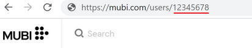

# mubi2letterboxd

## What?
_mubi2letterboxd_ is a simple command line utility for user data migration from [MUBI](https://mubi.com) to [letterboxd](https://letterboxd.com). With the utility, you can create a [.csv file](https://letterboxd.com/about/importing-data/) suitable for manual [import](https://letterboxd.com/import/) to Letterboxd.

## Why?
If you have an account on MUBI, the mubi2letterboxd utility can help you easily import your data to [letterboxd](https://letterboxd.com). 

## How?
Open your profile page on MUBI. Examine your browser address line to find out your UserID. UserID is a number at the end of the site address.

For using the program you need to [install](https://golang.org/doc/install) Go programming language

After successful installation run command:

`go run mubi2letterboxd.go`

Program will ask to input MUBI UserID for downloading data from MUBI and generates a _letterboxd.csv_ file suitable for import to Letterboxd.
