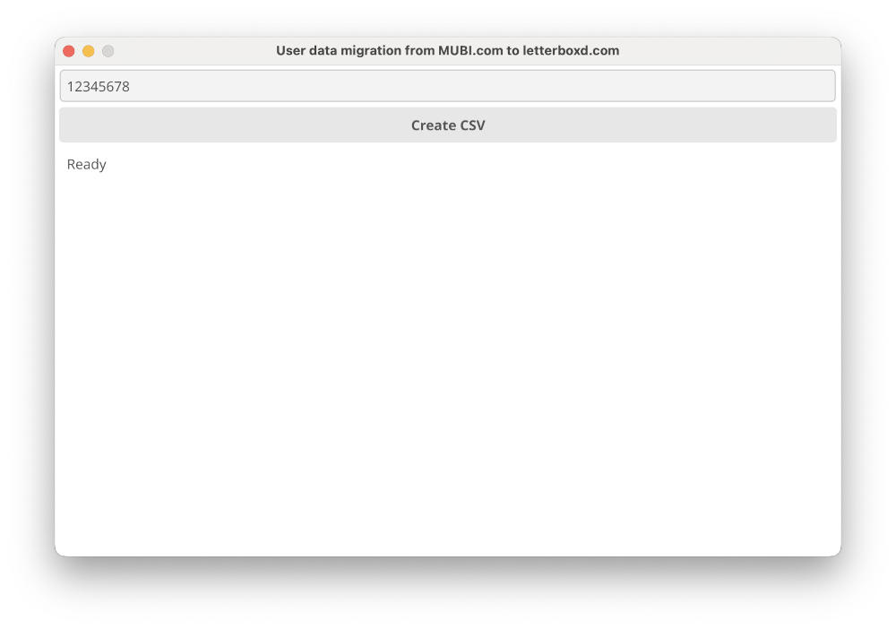

# mubi2letterboxd

## What?
_mubi2letterboxd_ is a simple GUI application for user data migration from [MUBI](https://mubi.com) to [letterboxd](https://letterboxd.com). With the utility, you can create a [.csv file](https://letterboxd.com/about/importing-data/) suitable for manual [import](https://letterboxd.com/import/) to Letterboxd.

## Why?
If you have an account on MUBI, the mubi2letterboxd utility can help you easily import your data to [letterboxd](https://letterboxd.com). 

## How?
Open your profile page on MUBI. Examine your browser address line to find out your UserID. UserID is a number at the end of the site address.

Then input UserID to the application window.

## Download

You can [download](https://github.com/hextriclosan/mubi2letterboxd/releases/tag/v2.0.0) binaries for either Windows (version 10 or higher), or MacOS operation systems.

## Build from sources
If you don't like to use binaries you can build the application by yourself.
You need to [install](https://golang.org/doc/install) Go programming language and [set up](https://developer.fyne.io/started/) Fyne.

After the successful installation run command:

`go build`

## CLI
Application also has a command line interface use the `--disable-gui` flag in order to enable it.
The program will ask to input MUBI UserID for downloading data from MUBI and generate a _letterboxd.csv_ file suitable for import to Letterboxd.
